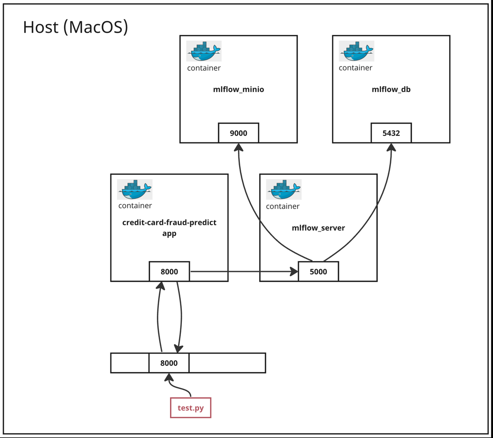

# Credit Card Fraud Detection


## Table of Contents
- [Description](#description)
- [Tech stack and ML concepts used](#tech_stack)
- [Project structure](#project_structure)
- [Local setup](#local_setup)
  - [Prerequisites](#prerequisites)
  - [Set up virtual environment and install dependencies](#setup_virtual_environment)
- [Exploring the data](#explore_the_data)
- [Running the web service locally](#running_locally)
  - [Start the web service](#start_web_service)
  - [Verify successful setup](#verify_successful_setup)
  - [Making requests to the web service](#making_requests)
- [Deploying to the cloud](#cloud_deployment)
  - [Prerequisites](#prerequisites)
- [Prediction results](#prediction_results)


## Description <a name = "description"></a>

This primary objective of this project is to train and deploy a Machine Learning model
to identify potentially fraudulent credit card transactions. 

A web service has been created to serve this model. This service exposes a `/predict`
endpoint which listens for incoming requests, with the body of each request containing
JSON-formatted credit card transaction details.

The dataset used in this project can be found in Kaggle [here](https://www.kaggle.com/datasets/nelgiriyewithana/credit-card-fraud-detection-dataset-2023?resource=download).
It contains credit card transactions made by European cardholders in the 
year 2023. It comprises over 550,000 records, and the data has been anonymized to protect the
cardholders' identities.


## Tech stack and ML concepts used <a name = "tech_stack"></a>
* Python
* Polars
* Pipenv
* Docker & Docker Compose
* Ruff formatter and linter
* Kubernetes
* Random Forest


## Project structure <a name = "project_structure"></a>

```
├── app/
│    ├── predict.py  -> Python script to serve the credit-card-fraud-detect model as a FastAPI web service
│    ├── test.py     -> Python script to make a sample request to the credit-card-fraud-detect app
├── data/
│    ├── creditcard_2023.csv   -> The dataset from the Kaggle url above needs to be downloaded and saved here.
├── docs/
│    ├── local_setup_docker.png   -> architecture diagram of the local Docker setup
├── k8s/
│    ├── app/  -> Kubernetes manifest files for the credit-card-fraud-detect app
│         ├── deployment.yaml  -> Kubernetes manifest file the Deployment
│         ├── namespace.yaml   -> Kubernetes manifest file for a namespace dedicated for the credit-card-fraud-detect app
│         ├── service.yaml     -> Kubernetes manifest file for the LoadBalancer Service
├── mlflow/
│    ├── docker-compose.yaml   -> docker-compose file to deploy MLflow locally
│    ├── Dockerfile            -> Dockerfile used by the docker-compose file in this directory
│    ├── get_mlflow_run_id.py  -> Python script to fetch the MLflow run with the highest score
│    ├── requirements.txt      -> Python dependencies for the Docker container used to deploy MLflow
├── ml_models/
│    ├── pipeline.pkl   -> A pickle file containing the final credit-card-fraud-detect model.
├── notebooks/
│    ├── development.ipynb   -> Notebook for interactive development. This includes model experimentation, 
│                               hyperparameter tuning and model evaluation.
├── schemas/
│    ├── credit_card_transaction.py   -> specifies the data structure for the body of HTTP requests submitted to the /predict endpoint
├── training/
│    ├── train.py   -> Python script to train the final ML model and save as a pickle file
├── .env   -> environment file used by the mlflow/docker-compose.yaml file 
├── docker-compose.yaml   ->  docker-compose file to deploy the credit-card-fraud-detect app locally
├── Dockerfile   -> Dockerfile used by the docker-compose file in this directory
├── Makefile   -> Makefile used to execute multiple commands in one to streamline the development process 
├── Pipfile   -> Manages Python dependencies
├── Pipfile.lock  -> Automatically generated to track exact versions of dependencies
├── README.md   -> Provides project information and usage instructions
```


## Local setup <a name = "local_setup"></a>

### Prerequisites <a name = "prerequisites"></a>
* Python version 3.11.3 - instructions to install specific version of Python on MacOS, 
    M1 Apple Silicon [here](https://laict.medium.com/install-python-on-macos-11-m1-apple-silicon-using-pyenv-12e0729427a9)
* Pipenv - on MacOS - `pip install --user pipenv`
* Docker - Installation instructions [here](https://docs.docker.com/engine/install/)
    Note, you also need Docker Compose. If you install Docker Desktop using the link
    above, this will come with Docker Compose out the box.
Download the dataset from the Kaggle url [here](https://www.kaggle.com/datasets/nelgiriyewithana/credit-card-fraud-detection-dataset-2023?resource=download) 
  and save it in data/creditcard_2023.csv

From your terminal, clone this repository and run `cd capstone` in the terminal.


> 💡 All the commands in this project from here on in should be executed from the
capstone directory


### Set up virtual environment and install dependencies <a name = "setup_virtual_environment"></a>
```
make setup
```

## Exploring the data <a name = "exploring_the_data"></a>

First we need to start MLflow, which is a tool we will use for ML experimentation in our
development Notebook.


First let's build and run the Docker images to start MLflow:
```
docker compose -f ./mlflow/docker-compose.yaml up -d --build
```
&ast;*The Docker containers can be terminated at any point using the command 
 `docker compose -f ./mlflow/docker-compose.yaml down`*

This will start up 3 services:
* A local Postgres database service
* A local MinIO service. This is a S3 compatible object store.
* A Server to route requests to the object store and Postgres database.


With our virtual environment now setup and the MLflow services now running, you will 
now be able to run the development.ipynb notebook. This notebook contains exploratory
data analysis, trains multiple ML models, tunes the parameters and evaluates performance
metrics, and finally selects the final model with the best performance.

You can access the MLflow UI at the following address: http://localhost:5001


## Running the web service locally <a name = "running_locally"></a>

Here is a diagram showing what the architecture will look like once all our containers
have been created. We will keep our MLflow containers running from the previous step,
because our credit-card-fraud-detect app will need to connect to it to load the model
artifact:




### Start the web service <a name = "start_web_service"></a>

I have created a script to get the run_id of the run with the highest rmse score. This
can be used in the next steps to configure the web service to download the ML model
associated with that run in MLflow. 
In a normal MLOps flow, the experiments and runs would be evaluated and compared with
one another. We might consider other factors such as how long the model takes train, 
but for simplicity here we can use the run_id generated by this script.


> 💡 it's important to run the development notebook and log a run in MLflow before
> executing the script in the next step.


1. Get the run_id for the best performing model:
    ```
    python mlflow/get_mlflow_run_id.py
    ```

2. Set an environment variable in the Dockerfile using the run_id printed in the
   terminal window from the previous step:
    ```
    export RUN_ID=<run_id>
    ```

3. Build the Docker image for the web service:
    ```
    docker compose up -d --build
    ```
   &ast;*The Docker containers can be terminated at any point using the command 
     `docker compose down`*


### Verify successful setup <a name = "verify_successful_setup"></a>
In a different terminal window, make a GET request to the `/health` endpoint of the 
churn prediction service: 
```
curl http://localhost:8000/health
```
This should return the following response if the endpoint is ready to accept requests:
`{"status": "healthy!"}`


### Making requests to the web service <a name = "making_requests"></a>
You can make HTTP requests to the web service using the POST method to get predictions
about whether a credit card transaction is likely fraudulent or not.

Run the following command to run the test.py script to make a sample request:
```
python app/test.py
```


## 🚀  Deploying to the cloud <a name = "cloud_deployment"></a>

### Prerequisites <a name = "prerequisites"></a>
* Install Minikube - instructions [here](https://minikube.sigs.k8s.io/docs/start/#:~:text=1-,Installation,-Click%20on%20the)

We will deploy our web service using a local Kubernetes cluster (Minikube).
See instructions below.

1. Setup a local minikube cluster:
    ```
    setup-local-k8s
    ```

2. Setup port forwarding:
    ```
    kubectl port-forward svc/credit-card-fraud-detect 8000:80 -n credit-card-fraud-detect
    ```
    This maps port 80 on our machine to port 80 on the Kubernetes Service, which the port that the
    LoadBalancer is listening on. We have to do this when running a local minikube cluster
    because minikube does not create an external-ip.


3. The same test.py script can be used here to make a sample request to the pod in the
   minikube cluster:
    ```
    python app/test.py
    ```

4. Tear down the Minikube cluster:
    ```
    destroy-local-k8s
    ```


## Prediction Results <a name = "prediction_results"></a>
| Model                  | Validation Set RMSE | Test Set Accuracy |
|------------------------|------------------|-------------------|
| Random Forest          | 0.013            | -                 |


